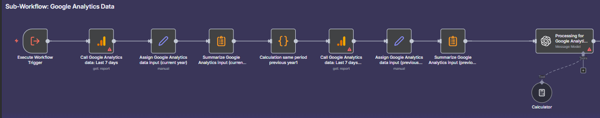

# Automation Workflows

A collection of automation tools and scripts built to optimize daily operations in a marketing agency — from campaign tracking and reporting to social media management, lead generation, and performance analytics.

This repository includes automation workflows, API integrations, and AI-driven solutions designed to save time, reduce manual effort, and enhance decision-making in marketing processes.

---

## ⚙️ Features

- 📊 **Automated campaign performance reports** (Google Ads, Meta, Google Analytics)
- 📅 **Social media scheduling & monitoring tools**
- 🔄 **Data syncing** between Google Sheets, HubSpot, and internal dashboards

---

## 🚀 Tech Stack

`Python` · `JavaScript` · `APIs (Google, Meta, LinkedIn)` · `Zapier` · `Notion API` · `OpenAI API` · `Pandas` · `FastAPI` · `Streamlit`

---

## 💡 Purpose

Created to centralize and streamline marketing operations — empowering teams to focus more on creative strategy while automation handles repetitive tasks.

---

## 🧭 Automation Workflows

Below are visual examples of the automation workflows included:

*Automates campaign reporting and data sync between Google Ads and Sheets.*

*Handles daily post scheduling and performance tracking.*

*Automates campaign reporting and data sync between Google Analytics and Sheets.*

*Automates lead generation and puts it in google sheets and send via email*

*Weekly reports assistant sends updates via email*
